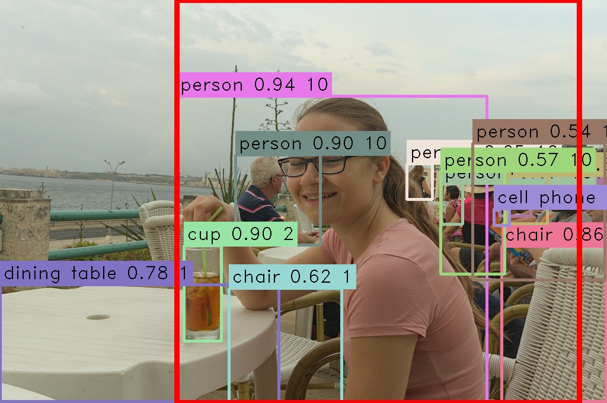

# SDImagePreprocess

This repo contains a collection of high performance tools intended to ease the createion of datasets for image generation AI training like stable diffusion.

## Included tools

This repo contains the following tools:

### SmartCrop

SmartCrop is an application that uses content aware croping using, [seam carving](https://en.wikipedia.org/wiki/Seam_carving) and resizeing to bring a directory of images into the deisred size and aspect ratio for training. SmartCrop ist configurable to prioritize specific items or specifc persons in the images provided.

#### Content detected in image:

#### Cropped image based on content:

### PersonDatasetAssembler

PersonDatasetAssembler is a python script that finds images of a spcific person, specified by a referance image in a directory of images or in a video file. PersonDatasetAssembler supports also raw images.

### LLavaTagger

LLavaTagger is a python script that tags images based on a given prompt using the [LLaVA](https://llava-vl.github.io/) multi modal llm. LLavaTagger supports using any number of gpus in ddp parralel for this task.

### DanbooruTagger

DanbooruTagger is a python script of dubious utility that tags images based using the [DeepDanbooru](https://github.com/KichangKim/DeepDanbooru) convolutional network.

## License

All files in this repo are litcenced GPL V3, see LICENSE
