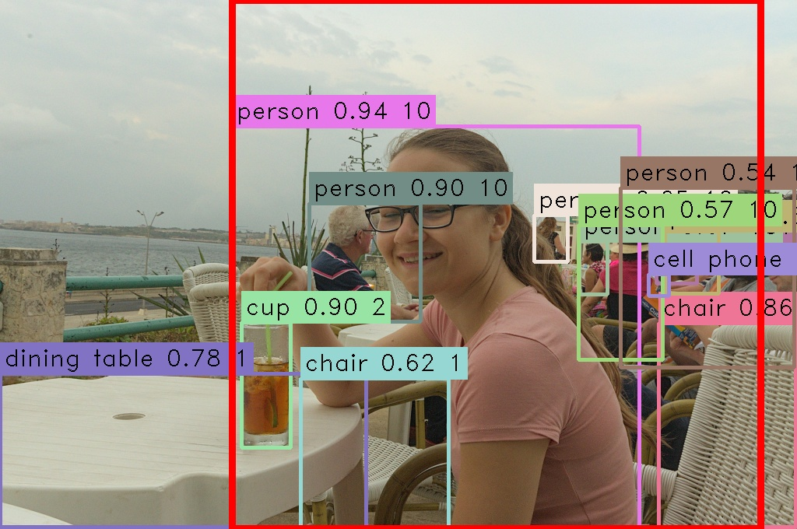
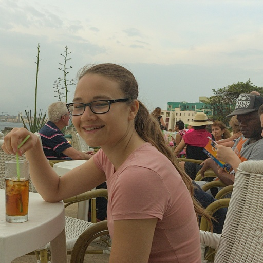

# SmartCrop

SmartCrop is an application that uses content aware croping using, [seam carving](https://en.wikipedia.org/wiki/Seam_carving) and resizeing to bring a directory of images into the deisred size and aspect ratio for training. SmartCrop ist configurable to prioritize specific items or specifc persons in the images provided.

## Requirements

* [cmake](https://cmake.org/) 3.6 or later
* [opencv](https://opencv.org/) 4.8 or later
* A c++17 capable compiler and standard lib like gcc or llvm/clang
* git is required to get the source

## Building

The steps to build this application are:

	$ git clone https://uvos.xyz/git/uvos/SDImagePreprocess.git
	$ cd SDImagePreprocess
	$ mkdir build
	$ cmake ..
	$ make

The binary can then be found in build/SmartCrop and can optionaly be installed with:

	$ sudo make install

## Basic usage

To process all images in the directory ~/images and output the images into ~/proceesedImages:

	$ smartcrop --out processedImages ~/images/*

To also focus on the person in the image ~/person.jpg

	$ smartcrop --out processedImages --focus-person ~/person.jpg ~/images/*

To also enable seam carving

	$ smartcrop --out processedImages --focus-person ~/person.jpg --seam-carving ~/images/*

see smartcrop --help for more

## Example

#### Content detected in image:

#### Cropped image based on content:

